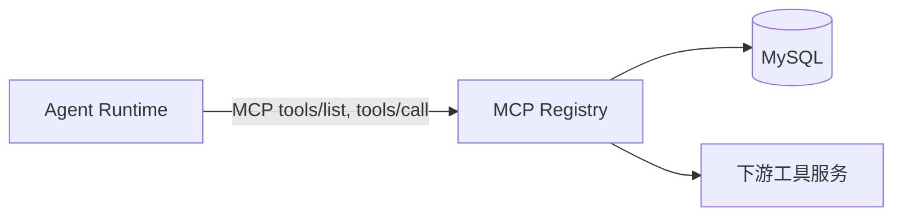

# 架构总览

本服务是 Agent 平台的 MCP 工具边界：维护外部服务和工具档案，解析输入 schema，并在 `/mcp` 上处理工具发现与调用，将可信上下文转发给下游 HTTP 服务。

```mermaid
flowchart LR
  Runtime[Agent Runtime] -->|MCP tools/list, tools/call| Registry[MCP Registry]
  Registry --> DB[(MySQL)]
  Registry --> Downstream[下游工具服务]
```

不负责 Agent/Skill 配置、对话任务状态或模型调用。
